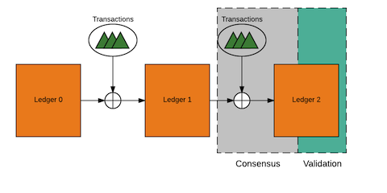
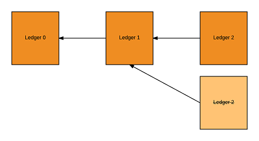
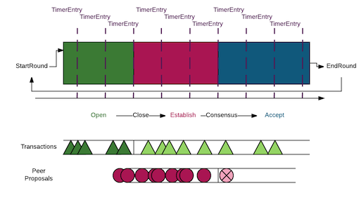
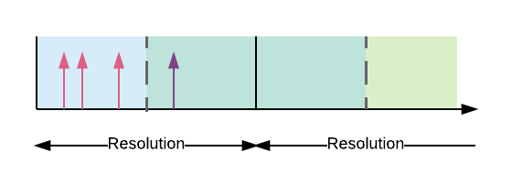
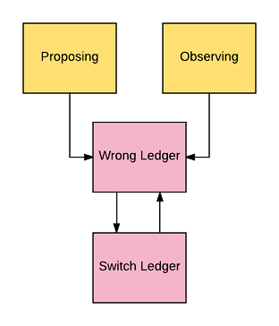
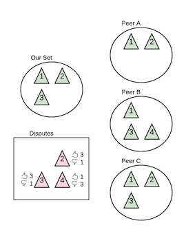
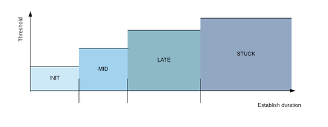

# Consensus and Validation

**This section is a work in progress!!**

Consensus is the task of reaching agreement within a distributed system in the
presence of faulty or even malicious participants.  This document outlines the
[JBCoin Consensus Algorithm](https://jbcoin.com/files/jbcoin/consensus/whitepaper.pdf)
as implemented in [jbcoind](https://github.com/jbcoin/jbcoind), but
focuses on its utility as a generic consensus algorithm independent of the
detailed mechanics of the JBCoin Consensus Ledger. Most notably, the algorithm
does not require fully synchronous communication between all nodes in the
network, or even a fixed network topology, but instead achieves consensus via
collectively trusted subnetworks.

## Distributed Agreement

A challenge for distributed systems is reaching agreement on changes in shared
state.  For the JBCoin network, the shared state is the current ledger--account
information, account balances, order books and other financial data.  We will
refer to shared distributed state as a /ledger/ throughout the remainder of this
document.



As shown above, new ledgers are made by applying a set of transactions to the
prior ledger.  For the JBCoin network, transactions include payments,
modification of account settings, updates to offers and more.

In a centralized system, generating the next ledger is trivial since there is a
single unique arbiter of which transactions to include and how to apply them to
a ledger.  For decentralized systems, participants must resolve disagreements on
the set of transactions to include, the order to apply those transactions, and
even the resulting ledger after applying the transactions.  This is even more
difficult when some participants are faulty or malicious.

The JBCoin network is a decentralized and **trust-full** network.  Anyone is free
to join and participants are free to choose a subset of peers that are
collectively trusted to not collude in an attempt to defraud the participant.
Leveraging this network of trust, the JBCoin algorithm has two main components.

* *Consensus* in which network participants agree on the transactions to apply
  to a prior ledger, based on the positions of their chosen peers.
* *Validation* in which network participants agree on what ledger was
  generated, based on the ledgers generated by chosen peers.

These phases are continually repeated to process transactions submitted to the
network, generating successive ledgers and giving rise to the blockchain ledger
history depicted below.  In this diagram, time is flowing to the right, but
links between ledgers point backward to the parent.  Also note the alternate
Ledger 2 that was generated by some participants, but which failed validation
and was abandoned.



The remainder of this section describes the Consensus and Validation algorithms
in more detail and is meant as a companion guide to understanding the generic
implementation in `jbcoind`.  The document **does not** discuss correctness,
fault-tolerance or liveness properties of the algorithms or the full details of
how they integrate within `jbcoind` to support the JBCoin Consensus Ledger.

## Consensus Overview

### Definitions

* The *ledger* is the shared distributed state.  Each ledger has a unique ID to
  distinguish it from all other ledgers.  During consensus, the *previous*,
  *prior* or *last-closed* ledger is the most recent ledger seen by consensus
  and is the basis upon which it will build the next ledger.
* A *transaction* is an instruction for an atomic change in the ledger state.  A
  unique ID distinguishes a transaction from other transactions.
* A *transaction set* is a set of transactions under consideration by consensus.
  The goal of consensus is to reach agreement on this set.  The generic
  consensus algorithm does not rely on an ordering of transactions within the
  set, nor does it specify how to apply a transaction set to a ledger to
  generate a new ledger.  A unique ID distinguishes a set of transactions from
  all other sets of transactions.
* A *node* is one of the distributed actors running the consensus algorithm.  It
  has a unique ID to distinguish it from all other nodes.
* A *peer*  of a node is another node that it has chosen to follow and which it
  believes will not collude with other chosen peers.  The choice of peers is not
  symmetric, since participants can decide on their chosen sets independently.
* A /position/ is the current belief of the next ledger's transaction set and
  close time. Position can refer to the node's own position or the position of a
  peer.
* A *proposal* is one of a sequence of positions a node shares during consensus.
  An initial proposal contains the starting position taken by a node before it
  considers any peer positions.  If a node subsequently updates its position in
  response to its peers, it will issue an updated proposal.  A proposal is
  uniquely identified by the ID of the proposing node, the ID of the position
  taken, the ID of the prior ledger the proposal is for, and the sequence number
  of the proposal.
* A *dispute* is a transaction that is either not part of a node's position or
  not in a peer's position. During consensus, the node will add or remove
  disputed transactions from its position based on that transaction's support
  amongst its peers.

Note that most types have an ID as a lightweight identifier of instances of that
type.  Consensus often operates on the IDs directly since the underlying type is
potentially expensive to share over the network.  For example, proposal's only
contain the ID of the position of a peer.  Since many peers likely have the same
position, this reduces the need to send the full transaction set multiple times.
Instead, a node can request the transaction set from the network if necessary.

### Overview 



The diagram above is an overview of the consensus process from the perspective
of a single participant.  Recall that during a single consensus round, a node is
trying to agree with its peers on which transactions to apply to its prior
ledger when generating the next ledger.  It also attempts to agree on the
[network time when the ledger closed](#effective_close_time).  There are
3 main phases to a consensus round:

* A call to `startRound` places the node in the `Open` phase.  In this phase,
the node is waiting for transactions to include in its open ledger.
* At some point, the node will `Close` the open ledger and transition to the
`Establish` phase.  In this phase, the node shares/receives peer proposals on
which transactions should be accepted in the closed ledger.
* At some point, the node determines it has reached consensus with its peers on
which transactions to include. It transitions to the `Accept` phase. In this
phase, the node works on applying the transactions to the prior ledger to
generate a new closed ledger. Once the new ledger is completed, the node shares
the validated ledger hash with the network and makes a call to `startRound` to
start the cycle again for the next ledger.

Throughout, a heartbeat timer calls `timerEntry` at a regular frequency to drive
the process forward. Although the `startRound` call occurs at arbitrary times
based on when the initial round began and the time it takes to apply
transactions, the transitions from `Open` to `Establish` and `Establish` to
`Accept` only occur during calls to `timerEntry`.  Similarly, transactions can
arrive at arbitrary times, independent of the heartbeat timer. Transactions
received after the `Open` to `Close` transition and not part of peer proposals
won't be considered until the next consensus round.  They are represented above
by the light green triangles.

Peer proposals are issued by a node during a `timerEntry` call, but since peers
do not synchronize `timerEntry` calls, they are received by other peers at
arbitrary times. Peer proposals are only considered if received prior to the
`Establish` to `Accept` transition, and only if the peer is working on the same
prior ledger. Peer proposals received after consensus is reached will not be
meaningful and are represented above by the circle with the X in it.  Only
proposals from chosen peers are considered.

### Effective Close Time ###         {#effective_close_time}
    
In addition to agreeing on a transaction set, each consensus round tries to
agree on the time the ledger closed.  Each node calculates its own close time
when it closes the open ledger.  This exact close time is rounded to the nearest
multiple of the current *effective close time resolution*.  It is this
*effective close time* that nodes seek to agree on. This allows servers to
derive a common time for a ledger without the need for perfectly synchronized
clocks. As depicted below, the 3 pink arrows represent exact close times from 3
consensus nodes that round to the same effective close time given the current
resolution. The purple arrow represents a peer whose estimate rounds to a
different effective close time given the current resolution.



The effective close time is part of the node's position and is shared with peers
in its proposals.  Just like the position on the consensus transaction set, a
node will update its close time position in response to its peers' effective
close time positions.  Peers can agree to disagree on the close time, in which
case the effective close time is taken as 1 second past the prior close.

The close time resolution is itself dynamic, decreasing (coarser) resolution in
subsequent consensus rounds if nodes are unable to reach consensus on an
effective close time and increasing (finer) resolution if nodes consistently
reach close time consensus.

### Modes

Internally, a node operates under one of the following consensus modes. Either
of the first two modes may be chosen when a consensus round starts.

* *Proposing* indicates the node is a full-fledged consensus participant.  It
  takes on positions and sends proposals to its peers.
* *Observing* indicates the node is a passive consensus participant.  It
  maintains a position internally, but does not propose that position to its
  peers. Instead, it receives peer proposals and updates its position
  to track the majority of its peers.  This may be preferred if the node is only
  being used to track the state of the network or during a start-up phase while
  it is still synchronizing with the network.

The other two modes are set internally during the consensus round when the node
believes it is no longer working on the dominant ledger chain based on peer
validations. It checks this on every call to `timerEntry`.

* *Wrong Ledger* indicates the node is not working on the correct prior ledger
  and does not have it available.  It requests that ledger from the network, but
  continues to work towards consensus this round while waiting.  If it had been
  *proposing*, it will send a special "bowout" proposal to its peers to indicate
  its change in mode for the rest of this round. For the duration of the round,
  it defers to peer positions for determining the consensus outcome as if it
  were just *observing*.
* *Switch Ledger* indicates that the node has acquired the correct prior ledger
  from the network. Although it now has the correct prior ledger, the fact that
  it had the wrong one at some point during this round means it is likely behind
  and should defer to peer positions for determining the consensus outcome.



Once either wrong ledger or switch ledger are reached, the node cannot
return to proposing or observing until the next consensus round.  However,
the node could change its view of the correct prior ledger, so going from
switch ledger to wrong ledger and back again is possible.

The distinction between the wrong and switched ledger modes arises because a
ledger's unique identifier may be known by a node before the ledger itself. This
reflects that fact that the data corresponding to a ledger may be large and take
time to share over the network, whereas the smaller ID could be shared in a peer
validation much more quickly. Distinguishing the two states allows the node to
decide how best to generate the next ledger once it declares consensus.

### Phases

As depicted in the overview diagram, consensus is best viewed as a progression
through 3 phases.  There are 4 public methods of the generic consensus algorithm
that determine this progression

* `startRound` begins a consensus round.
* `timerEntry` is called at a regular frequency (`LEDGER_MIN_CLOSE`) and is the
  only call to consensus that can change the  phase from `Open` to `Establish`
  or `Accept`.
* `peerProposal` is called whenever a peer proposal is received and is what
  allows a node to update its position in a subsequent `timerEntry` call.
* `gotTxSet` is called when a transaction set is received from the network. This
  is typically in response to a prior request from the node to acquire the
  transaction set corresponding to a disagreeing peer's position.

The following subsections describe each consensus phase in more detail and what
actions are taken in response to these calls.

#### Open

The `Open` phase is a quiescent period to allow transactions to build up in the
node's open ledger.  The duration is a trade-off between latency and throughput.
A shorter window reduces the latency to generating the next ledger, but also
reduces transaction throughput due to fewer transactions accepted into the
ledger.

A call to `startRound` would forcibly begin the next consensus round, skipping
completion of the current round.  This is not expected during normal operation.
Calls to `peerProposal` or `gotTxSet` simply store the proposal or transaction
set for use in the coming `Establish` phase.

A call to `timerEntry` first checks that the node is working on the correct
prior ledger. If not, it will update the mode and request the correct ledger.
Otherwise, the node checks whether to switch to the `Establish` phase and close
the ledger.

##### Ledger Close

Under normal circumstances, the open ledger period ends when one of the following
is true

* if there are transactions in the open ledger and more than `LEDGER_MIN_CLOSE`
  have elapsed.  This is the typical behavior.
* if there are no open transactions and a suitably longer idle interval has
  elapsed.  This increases the opportunity to get some transaction into
  the next ledger and avoids doing useless work closing an empty ledger.
* if more than half the number of prior round peers have already closed or finished
  this round. This indicates the node is falling behind and needs to catch up.


When closing the ledger, the node takes its initial position based on the
transactions in the open ledger and uses the current time as
its initial close time estimate.  If in the proposing mode, the node shares its
initial position with peers.  Now that the node has taken a position, it will
consider any peer positions for this round that arrived earlier.  The node
generates disputed transactions for each transaction not in common with a peer's
position.  The node also records the vote of each peer for each disputed
transaction.

In the example below, we suppose our node has closed with transactions 1,2 and 3.  It creates disputes
for transactions 2,3 and 4, since at least one peer position differs on each.

##### disputes #####     {#disputes_image}



#### Establish

The establish phase is the active period of consensus in which the node
exchanges proposals with peers in an attempt to reach agreement on the consensus
transactions and effective close time.

A call to `startRound` would forcibly begin the next consensus round, skipping
completion of the current round.  This is not expected during normal operation.
Calls to `peerProposal` or `gotTxSet` that reflect new positions will generate
disputed transactions for any new disagreements and will update the peer's vote
for all disputed transactions.

A call to `timerEntry` first checks that the node is working from the correct
prior ledger. If not, the node  will update the mode and request the correct
ledger.  Otherwise, the node updates the node's position and considers whether
to switch to the `Accepted` phase and declare consensus reached.  However, at
least `LEDGER_MIN_CONSENSUS` time must have elapsed before doing either.  This
allows peers an opportunity to take an initial position and share it.

##### Update Position

In order to achieve consensus, the node is looking for a transaction set that is
supported by a super-majority of peers.  The node works towards this set by
adding or removing disputed transactions from its position based on an
increasing threshold for inclusion.



By starting with a lower threshold, a node initially allows a wide set of
transactions into its position. If the establish round continues and the node is
"stuck", a higher threshold can focus on accepting transactions with the most
support.  The constants that define the thresholds and durations at which the
thresholds change are given by `AV_XXX_CONSENSUS_PCT` and
`AV_XXX_CONSENSUS_TIME` respectively, where `XXX` is `INIT`,`MID`,`LATE` and
`STUCK`.  The effective close time position is updated using the same
thresholds.

Given the [example disputes above](#disputes_image) and an initial threshold
of 50%, our node would retain its position since transaction 1 was not in
dispute and transactions 2 and 3 have 75% support.  Since its position did not
change, it would not need to send a new proposal to peers.  Peer C would not
change either. Peer A would add transaction 3 to its position and Peer B would
remove transaction 4 from its position; both would then send an updated
position.

Conversely, if the diagram reflected a later call to =timerEntry= that occurs in
the stuck region with a threshold of say 95%, our node would remove transactions
2 and 3 from its candidate set and send an updated position.  Likewise, all the
other peers would end up with only transaction 1 in their position.

Lastly, if our node were not in the proposing mode, it would not include its own
vote and just take the majority (>50%) position of its peers. In this example,
our node would maintain its position of transactions 1, 2 and 3.

##### Checking Consensus

After updating its position, the node checks for supermajority agreement with
its peers on its current position.  This agreement is of the exact transaction
set, not just the support of individual transactions. That is, if our position
is a subset of a peer's position, that counts as a disagreement. Also recall
that effective close time agreement allows a supermajority of participants
agreeing to disagree.

Consensus is declared when the following 3 clauses are true:

* `LEDGER_MIN_CONSENSUS` time has elapsed in the establish phase
* At least 75% of the prior round proposers have proposed OR this establish
  phase is `LEDGER_MIN_CONSENSUS` longer than the last round's establish phase
* `minimumConsensusPercentage` of ourself and our peers share the same position

The middle condition ensures slower peers have a chance to share positions, but
prevents waiting too long on peers that have disconnected. Additionally, a node
can declare that consensus has moved on if `minimumConsensusPercentage` peers
have sent validations and moved on to the next ledger. This outcome indicates
the node has fallen behind its peers and needs to catch up.

If a node is not proposing, it does not include its own position when
calculating the percent of agreeing participants but otherwise follows the above
logic.

##### Accepting Consensus

Once consensus is reached (or moved on), the node switches to the `Accept` phase
and signals to the implementing code that the round is complete. That code is
responsible for using the consensus transaction set to generate the next ledger
and calling `startRound` to begin the next round.  The implementation has total
freedom on ordering transactions, deciding what to do if consensus moved on,
determining whether to retry or abandon local transactions that did not make the
consensus set and updating any internal state based on the consensus progress.

#### Accept

The `Accept` phase is the terminal phase of the consensus algorithm.  Calls to
`timerEntry`, `peerProposal` and `gotTxSet` will not change the internal
consensus state while in the accept phase.  The expectation is that the
application specific code is working to generate the new ledger based on the
consensus outcome. Once complete, that code should make a call to `startRound`
to kick off the next consensus round. The `startRound` call includes the new
prior ledger, prior ledger ID and whether the round should begin in the
proposing or observing mode.  After setting some initial state, the phase
transitions to `Open`.  The node will also check if the provided prior ledger
and ID are correct, updating the mode and requesting the proper ledger from the
network if necessary.

## Consensus Type Requirements

The consensus type requirements are given below as minimal implementation stubs.
Actual implementations would augment these stubs with members appropriate for
managing the details of transactions and ledgers within the larger application
framework.

### Transaction

The transaction type `Tx` encapsulates a single transaction under consideration
by consensus.

```{.cpp}
struct Tx
{
   using ID = ...;
   ID const & id() const;

   //... implementation specific
};
```

### Transaction Set

The transaction set type `TxSet` represents a set of `Tx`s that are collectively
under consideration by consensus. A `TxSet` can be compared against other `TxSet`s
(typically from peers) and can be modified to add or remove transactions via
the mutable subtype.

```{.cpp}
struct TxSet
{
  using Tx = Tx;
  using ID = ...;

  ID const & id() const;

  bool exists(Tx::ID const &) const;
  Tx const * find(Tx::ID const &) const ;

  // Return set of transactions that are not common with another set
  // Bool in map is true if in our set, false if in other
  std::map<Tx::ID, bool> compare(TxSet const & other) const;

  // A mutable view that allows changing transactions in the set
  struct MutableTxSet
  {
      MutableTxSet(TxSet const &);
      bool insert(Tx const &);
      bool erase(Tx::ID const &);
  };

  // Construct from a mutable view.
  TxSet(MutableTxSet const &);

  // Alternatively, if the TxSet is itself mutable
  // just alias MutableTxSet = TxSet

  //... implementation specific
};
```

### Ledger

The `Ledger` type represents the state shared amongst the
distributed participants.  Notice that the details of how the next ledger is
generated from the prior ledger and the consensus accepted transaction set is
not part of the interface.  Within the generic code, this type is primarily used
to know that peers are working on the same tip of the ledger chain and to
provide some basic timing data for consensus.

```{.cpp}
struct Ledger
{
  using ID = ...;

  using Seq = //std::uint32_t?...;

  ID const & id() const;

  // Sequence number that is 1 more than the parent ledger's seq()
  Seq seq() const;

  // Whether the ledger's close time was a non-trivial consensus result
  bool closeAgree() const;

  // The close time resolution used in determing the close time
  NetClock::duration closeTimeResolution() const;

  // The (effective) close time, based on the closeTimeResolution
  NetClock::time_point closeTime() const;

  // The parent ledger's close time
  NetClock::time_point parentCloseTime() const;

  Json::Value getJson() const;

  //... implementation specific
};
```

### PeerProposal

The `PeerProposal` type represents the signed position taken
by a peer during consensus. The only type requirement is owning an instance of a
generic `ConsensusProposal`.

```{.cpp}
// Represents our proposed position or a peer's proposed position
// and is provided with the generic code
template <class NodeID_t, class LedgerID_t, class Position_t> class ConsensusProposal;

struct PeerPosition
{
  ConsensusProposal<
      NodeID_t,
      typename Ledger::ID,
      typename TxSet::ID> const &
  proposal() const;

  // ... implementation specific
};
```

### Generic Consensus Interface

The generic `Consensus` relies on `Adaptor` template class to implement a set
of helper functions that plug the consensus algorithm into a specific application.
The `Adaptor` class also defines the types above needed by the algorithm. Below
are excerpts of the generic consensus implementation and of helper types that will
interact with the concrete implementing class.

```{.cpp}
// Represents a transction under dispute this round
template <class Tx_t, class NodeID_t> class DisputedTx;

// Represents how the node participates in Consensus this round
enum class ConsensusMode { proposing, observing, wrongLedger, switchedLedger};

// Measure duration of phases of consensus
class ConsensusTimer
{
public:
    std::chrono::milliseconds read() const;
    // details omitted ...
};

// Initial ledger close times, not rounded by closeTimeResolution
// Used to gauge degree of synchronization between a node and its peers
struct ConsensusCloseTimes
{
    std::map<NetClock::time_point, int> peers;
    NetClock::time_point self;
};

// Encapsulates the result of consensus.
template <class Adaptor>
struct ConsensusResult
{
    //! The set of transactions consensus agrees go in the ledger
    Adaptor::TxSet_t set;

    //! Our proposed position on transactions/close time
    ConsensusProposal<...> position;

    //! Transactions which are under dispute with our peers
    hash_map<Adaptor::Tx_t::ID, DisputedTx<...>> disputes;

    // Set of TxSet ids we have already compared/created disputes
    hash_set<typename Adaptor::TxSet_t::ID> compares;

    // Measures the duration of the establish phase for this consensus round
    ConsensusTimer roundTime;

    // Indicates state in which consensus ended.  Once in the accept phase
    // will be either Yes or MovedOn
    ConsensusState state = ConsensusState::No;
};

template <class Adaptor>
class Consensus
{
public:
    Consensus(clock_type, Adaptor &, beast::journal);

    // Kick-off the next round of consensus.
    void startRound(
        NetClock::time_point const& now,
        typename Ledger_t::ID const& prevLedgerID,
        Ledger_t const& prevLedger,
        bool proposing);

    // Call periodically to drive consensus forward.
    void timerEntry(NetClock::time_point const& now);

    // A peer has proposed a new position, adjust our tracking.  Return true if the proposal
    // was used.
    bool peerProposal(NetClock::time_point const& now, Proposal_t const& newProposal);

    // Process a transaction set acquired from the network
    void gotTxSet(NetClock::time_point const& now, TxSet_t const& txSet);

    // ... details
};
```

### Adapting Generic Consensus

The stub below shows the set of callback/helper functions required in the implementing class.

```{.cpp}
struct Adaptor
{
    using Ledger_t = Ledger;
    using TxSet_t = TxSet;
    using PeerProposal_t = PeerProposal;
    using NodeID_t = ...; // Integer-like std::uint32_t to uniquely identify a node


    // Attempt to acquire a specific ledger from the network.
    boost::optional<Ledger> acquireLedger(Ledger::ID const & ledgerID);

    // Acquire the transaction set associated with a proposed position.
    boost::optional<TxSet> acquireTxSet(TxSet::ID const & setID);

    // Whether any transactions are in the open ledger
    bool hasOpenTransactions() const;

    // Number of proposers that have validated the given ledger
    std::size_t proposersValidated(Ledger::ID const & prevLedger) const;

    // Number of proposers that have validated a ledger descended from the
    // given ledger
    std::size_t proposersFinished(Ledger::ID const & prevLedger) const;

    // Return the ID of the last closed (and validated) ledger that the
    // application thinks consensus should use as the prior ledger.
    Ledger::ID getPrevLedger(Ledger::ID const & prevLedgerID,
                    Ledger const & prevLedger,
                    ConsensusMode mode);

    // Called when consensus operating mode changes
    void onModeChange(ConsensuMode before, ConsensusMode after);
    
    // Called when ledger closes.  Implementation should generate an initial Result
    // with position based on the current open ledger's transactions.
    ConsensusResult onClose(Ledger const &, Ledger const & prev, ConsensusMode mode);

    // Called when ledger is accepted by consensus
    void onAccept(ConsensusResult const & result,
      RCLCxLedger const & prevLedger,
      NetClock::duration closeResolution,
      ConsensusCloseTimes const & rawCloseTimes,
      ConsensusMode const & mode);

    // Propose the position to peers.
    void propose(ConsensusProposal<...> const & pos);

    // Share a received peer proposal with other peers.
    void share(PeerPosition_t const & pos);

    // Share a disputed transaction with peers
    void share(TxSet::Tx const & tx);

    // Share given transaction set with peers
    void share(TxSet const &s);

    //... implementation specific
};
```

The implementing class hides many details of the peer communication
model from the generic code.

* The `share` member functions are responsible for sharing the given type with a
  node's peers, but are agnostic to the mechanism. Ideally, messages are delivered
  faster than `LEDGER_GRANULARITY`. 
* The generic code does not specify how transactions are submitted by clients,
  propagated through the network or stored in the open ledger. Indeed, the open
  ledger is only conceptual from the perspective of the generic code---the
  initial position and transaction set are opaquely generated in a
  `Consensus::Result` instance returned from the `onClose` callback.
* The calls to `acquireLedger` and `acquireTxSet` only have non-trivial return
  if the ledger or transaction set of interest is available.  The implementing
  class is free to block while acquiring, or return the empty option while
  servicing the request asynchronously.  Due to legacy reasons, the two calls
  are not symmetric. `acquireTxSet` requires the host application to call
  `gotTxSet` when an asynchronous `acquire` completes. Conversely,
  `acquireLedger` will be called again later by the consensus code if it still
  desires the ledger with the hope that the asynchronous acquisition is
  complete.


## Validation

Coming Soon!


